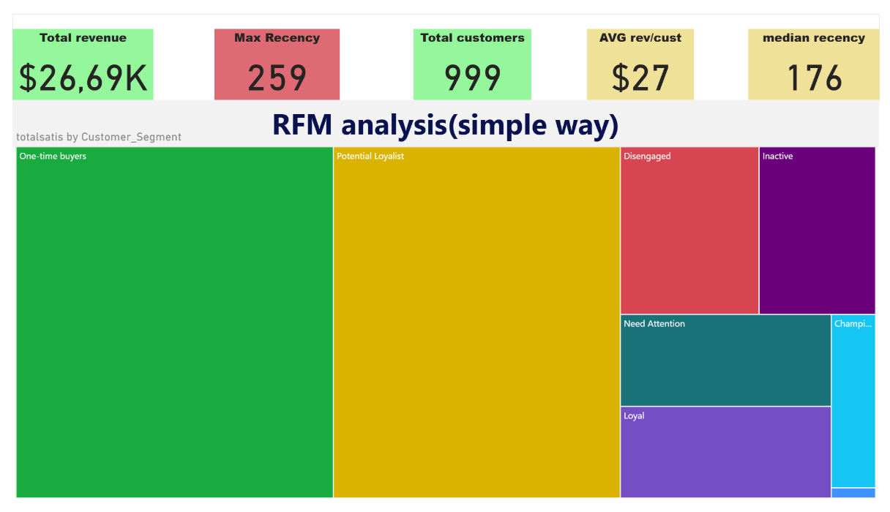

# RFM-segmentation-with-SQL-and-Power-BI
SQL-based data cleaning and transformation for RFM analysis, combined with interactive Power BI dashboards to visualize customer segmentation and insights. A complete solution for understanding customer behavior and optimizing marketing strategies.

# 📊 RFM SQL & Power BI Project

## 🎯 Project Overview
**RFM Analysis** (Recency, Frequency, Monetary) is a powerful technique for segmenting customers based on their transaction history.
It helps businesses understand customer behavior and optimize marketing strategies.  

This repository demonstrates how to preprocess data with **SQL** and build interactive dashboards with **Power BI** to visualize RFM insights.

---

## 🚀 Key Features
✅ **SQL-based data preprocessing** – Calculation of Recency, Frequency, and Monetary metrics.  
✅ **SQL queries** – Extracting, cleaning, and preparing data for RFM analysis.  
✅ **Power BI dashboard** – Visualizing customer segments and behavioral trends.  
✅ **RFM scoring and segmentation** – Classifying customers into categories such as `Loyal`, `At-Risk`, or `New`.

---

## 📈 Use Cases
- Customer segmentation for targeted marketing  
- Identifying loyal, high-value customers  
- Re-engaging dormant or at-risk customers  

---

## 🛠 Technologies Used
- SQL – Data extraction, transformation, and RFM metric calculation  
- Power BI – Data visualization, interactive dashboards, and reporting  
- Excel *(optional)* – Initial data preparation if needed
